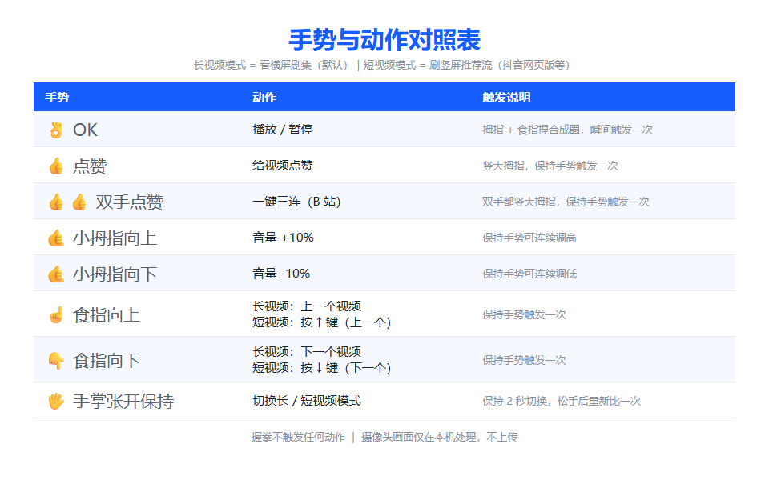
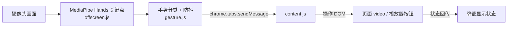
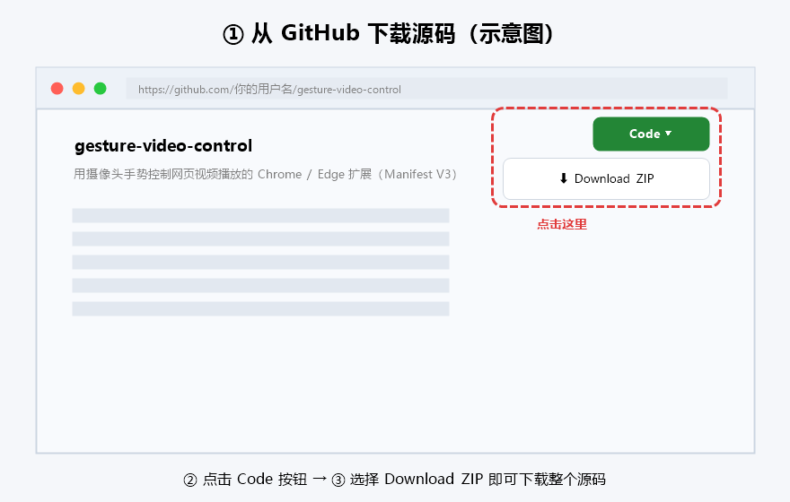
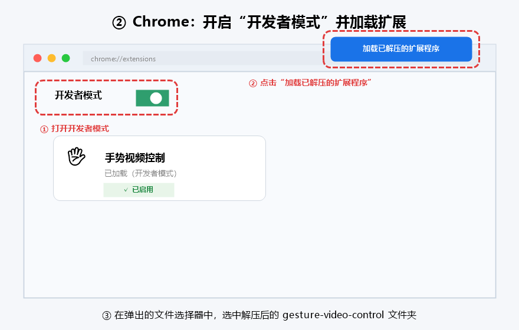
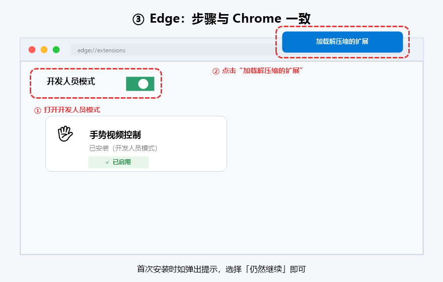

# 手势视频控制 · Gesture Video Control

> 用摄像头手势控制网页视频播放的 **Chrome / Edge 扩展（Manifest V3）**。
> OK 手势播放/暂停、小拇指上下调节音量、食指上下切换视频，支持长/短视频双模式，B 站、YouTube 等任意网页播放器。



---

## 目录

- [项目介绍](#项目介绍)
- [功能特性](#功能特性)
- [手势映射表](#手势映射表)
- [工作原理](#工作原理)
- [项目结构](#项目结构)
- [安装教程（图文）](#安装教程图文)
- [使用方法与技巧](#使用方法与技巧)
- [如何打包 .crx（发布者用）](#如何打包-crx发布者用)
- [常见问题 FAQ](#常见问题-faq)
- [隐私说明](#隐私说明)
- [免责声明](#免责声明)
- [开源协议](#开源协议)

---

## 项目介绍

这个扩展通过摄像头实时捕捉你的手部动作，利用 **MediaPipe Hands** 在浏览器本地识别 21 个手部关键点，再把识别出的手势转换成播放控制指令，通过消息机制发送给当前网页，直接操作页面上的 `<video>` 元素或播放器按钮。

**适合场景**：吃饭、健身、做家务时不想碰键盘鼠标，用手势就能控制视频；也适合用来学习和体验「浏览器扩展 + 摄像头 + 端侧 AI」的组合开发。

## 功能特性

- 摄像头实时手势识别（MediaPipe Hands，本地推理，画面**不上传**）
- MediaPipe 模型随扩展**本地打包**（MV3 禁止扩展加载远程代码，CDN 会被浏览器拒绝），无需联网即可使用
- 识别在**后台（offscreen）运行**：关闭弹窗不影响手势控制，也不遮挡视频画面
- 弹窗显示后台识别预览、当前手势、模型状态、页面视频状态
- 支持**页面内悬浮面板**：可拖动、可缩放、可隐藏摄像头画面、可最小化为悬浮球，识别全程不中断
- 「开启 / 关闭手势控制」一键开关，开关状态自动记忆
- **防抖 + 稳定帧检测**：手势需连续稳定数帧才会触发，避免误触
- 音量手势支持**长按连续调节**
- 适配 YouTube / B 站「下一集 / 上一集」按钮，其它网站有通用兜底
- **点赞 / 一键三连**：竖大拇指点赞，双手同时竖大拇指一键三连（B 站长按点赞按钮触发）
- **长 / 短视频双模式**：手掌张开保持 2 秒一键切换；短视频模式下食指上下直接模拟键盘 ↑/↓ 切视频，兼容抖音网页版等推荐流
- 页面操作成功后会弹出轻量提示浮层（Shadow DOM 隔离，不污染页面样式）
- 权限最小化：仅使用 `activeTab + scripting + storage`，不申请全站权限

## 手势映射表

| 手势 | 动作 | 触发说明 |
| --- | --- | --- |
| 👌 OK（拇指 + 食指捏合成圈） | 播放 / 暂停 | 捏合**瞬间**触发一次，防抖 900ms |
| 👍 竖大拇指（点赞） | 给视频点赞 | 保持手势触发一次（抖音按 Z 键，其它站点自动找点赞按钮） |
| 👍👍 双手同时竖大拇指 | 一键三连（B 站） | 保持手势触发一次（B 站长按点赞按钮 / 按 R 键，其它站点退化为点赞） |
| 🤙 单个小拇指向上 | 音量 +10% | 保持手势可连续调高（约 0.65s 一次） |
| 🤙 单个小拇指向下 | 音量 -10% | 保持手势可连续调低 |
| ☝️ 单个食指向上 | 长视频：上一个视频 / 短视频：按 ↑ 键（上一个视频） | 保持手势触发一次 |
| 👇 单个食指向下 | 长视频：下一个视频 / 短视频：按 ↓ 键（下一个视频） | 保持手势触发一次 |
| 🖐️ 手掌张开保持 2 秒 | 切换长 / 短视频模式 | 切换一次后需松手重新比一次 |
> 注意：OK 手势不是靠“声音”识别（浏览器无法安全监听麦克风），而是靠“拇指尖与食指尖捏合成圈”的动作来识别。

**长 / 短视频模式**：

- 默认是**长视频模式**（看横屏剧集）：食指向上 = 上一个视频，食指向下 = 下一个视频；
- **短视频模式**（刷竖屏视频流，如抖音网页版、B 站推荐流、YouTube Shorts）：食指向上 = 按键盘 ↑（上一个视频），食指向下 = 按键盘 ↓（下一个视频），利用网站自带的方向键直切，避免误滚侧边栏；
- 切换方式：手掌张开（五指向上）保持 **2 秒**；再保持 2 秒切回。也可以直接在弹窗 / 悬浮面板里点「短视频模式」开关。

## 工作原理



1. 点击扩展图标打开弹窗，打开「手势控制」开关后，摄像头与识别引擎在**不可见的离屏文档**（`offscreen.html`）中启动，并加载扩展内**本地打包**的 MediaPipe Hands 模型（无需联网）；
2. 每一帧摄像头画面在后台完成手部关键点识别与手势分类；
3. 识别到有效动作后，后台引擎把动作消息发给目标标签页的 `content.js`；
4. `content.js` 找到页面主 `<video>` 执行播放/暂停/音量调节，或点击“下一集/上一集”按钮 / 模拟方向键切视频；
5. 执行结果回传弹窗展示，同时在页面上显示一条短暂提示；
6. **关闭弹窗后识别继续在后台运行**，你可以专心看视频，随时打开弹窗查看状态或关闭控制。

## 项目结构

```text
gesture-video-control/
├── manifest.json        # MV3 清单：权限、弹窗、CSP
├── background.js        # Service Worker：安装时写入默认设置（防抖/音量步长）
├── content.js           # 内容脚本：操作页面 <video> 与切集按钮
├── gesture.js           # 手势分类纯函数（MediaPipe 关键点 → 手势名称）
├── offscreen.html       # 离屏文档：后台运行摄像头 + 手势识别（不可见）
├── offscreen.js         # 后台识别引擎：摄像头、模型、识别循环、指令发送
├── grant.html / grant.js# 一次性“摄像头授权页”（弹窗权限提示失效时的兜底）
├── float.html           # 旧版独立悬浮窗（已由页面内悬浮面板取代，暂保留）
├── float.css            # 悬浮窗样式
├── float.js             # 悬浮窗控制器（预览、状态、启停后台识别）
├── popup.html           # 弹窗：遥控器（预览、手势、状态、开关）
├── popup.css            # 弹窗样式
├── popup.js             # 弹窗控制器：启停后台识别、状态显示、预览
├── vendor/mediapipe/    # MediaPipe Tasks Vision 本地化资源（vision_bundle.mjs / wasm / hand_landmarker.task）
├── icons/               # 扩展图标（16/32/48/128）
├── docs/                # README 配图
├── pack-crx.ps1         # 一键打包 .crx（Windows）
├── pack-crx.bat         # 打包脚本的批处理入口
├── LICENSE              # MIT 协议
└── .gitignore           # 忽略 .pem 私钥等敏感/产物文件
```

## 安装教程（图文）

### 一、从 GitHub 下载源码

1. 打开本项目的 GitHub 仓库主页；
2. 点击页面右侧绿色的 **Code** 按钮，再选择 **Download ZIP**；
3. 把压缩包解压到任意目录（建议路径为纯英文，例如 `D:\extensions\gesture-video-control`）。



### 二、在 Chrome 中加载扩展

1. 在地址栏输入 `chrome://extensions` 并回车；
2. 打开右上角的 **开发者模式** 开关；
3. 点击左上角 **加载已解压的扩展程序**；
4. 选择刚才解压出来的 **gesture-video-control** 文件夹（直接包含 `manifest.json` 的那一层）；
5. 列表中看到「手势视频控制」即安装成功。



### 三、在 Edge 中加载扩展

步骤与 Chrome 完全一致：

1. 地址栏输入 `edge://extensions` 并回车；
2. 打开左侧的 **开发人员模式** 开关；
3. 点击 **加载解压缩的扩展**；
4. 选择解压出的 `gesture-video-control` 文件夹。



> Edge 首次安装开发者模式扩展时会弹出一个提示，选择「仍然继续」即可。

### 四、通过 Release 安装 .crx（可选，适合小白）

如果维护者在 [Releases](https://github.com/) 页提供了打包好的 `.crx` 文件：

1. 下载 `.crx` 文件；
2. 打开 `chrome://extensions` 并开启开发者模式；
3. 把 `.crx` 文件**直接拖进**扩展管理页面，点击「添加扩展程序」；
4. 若浏览器提示「请停用开发者模式下的扩展程序」，忽略即可（仅影响商店内购功能，不影响本扩展）。

> 该 `.crx` 仅供开发者模式安装使用，不是 Chrome 应用商店的正式签名。

## 使用方法与技巧

1. 打开任意视频网站（B 站、YouTube 等）并播放一个视频；
2. 点击浏览器工具栏中的扩展图标，打开控制弹窗；
3. 打开「手势控制」开关，后台识别自动启动；首次使用会弹出摄像头权限提示，选择**允许**；
4. 等待状态行显示「后台手势识别运行中」；
5. **关闭弹窗即可**，识别继续在后台运行，不遮挡视频；
6. 对着摄像头做手势即可控制视频。

**使用悬浮面板（推荐看视频时用）**：

- 在弹窗中点击「🪟 打开悬浮面板」，会在**当前页面**出现一块可拖动的悬浮面板（类似画中画），不再打开新窗口；
- 面板显示摄像头画面与当前手势，点标题栏的 **👁** 可显示 / 隐藏画面，点 **—** 可最小化为一个小悬浮球（识别不中断），点 **✕** 关闭面板（识别同样不中断）；
- 拖动面板**标题栏**可任意移动位置，拖动**右下角**可缩放面板大小，位置和大小会自动记忆；
- 拖动**画面底部的分隔条**可自由调整摄像头画面窗口的大小（弹窗和悬浮面板都支持，弹窗 100~320px、面板 90~320px，自动记忆）；
- 在**摄像头画面上滚动鼠标滚轮**可自由缩放画面（0.5x~4x，以鼠标位置为中心），放大后按住画面拖动可查看细节，**双击画面**恢复 100%，缩放状态自动记忆；
- 悬浮球上的圆点变绿表示后台识别正在运行，点悬浮球即可恢复面板。

> **如果打开开关后提示“权限被拒绝”、且没有出现权限提示**（Chrome 弹窗的已知问题）：
> 点击弹窗中的「📷 在标签页中授权摄像头」按钮，在新打开的标签页里授权一次即可——
> 授权后可以关闭该标签页，后台识别会自动接管。

**重要提示**：

- 弹窗关闭后识别**不会停止**（后台运行）；如需关闭控制，重新打开弹窗并关掉「手势控制」开关即可；
- 切换标签页后，需要**重新点击一次扩展图标**并重新打开开关（activeTab 权限只在点击后对该标签页生效，后台引擎会改控新的目标页）；
- 摄像头使用时，浏览器工具栏会出现相机使用指示，这是正常的；
- 建议距离摄像头 **40~80cm**，光线充足，手掌完整入镜；
- OK = 拇指与食指捏合成圈（不是打响指）；
- 音量 = 小拇指单独伸直指向上/下，保持姿势可连续调节；
- 切集 = 单个食指伸直朝上/朝下一次；短视频模式下食指直接触发键盘 ↑/↓ 切视频。

## 如何打包 .crx（发布者用）

### 方式一：一键脚本（Windows）

在项目目录双击 `pack-crx.bat`，或执行：

```powershell
powershell -ExecutionPolicy Bypass -File .\pack-crx.ps1
```

脚本会自动寻找本机 Chrome / Edge 并打包，产物输出到项目目录的**上一级**：

- `gesture-video-control.crx` —— 可上传到 GitHub Release 供用户拖拽安装；
- `gesture-video-control.pem` —— **扩展私钥，请务必保密，不要提交到仓库**（`.gitignore` 已忽略）。

以后想保持同一个扩展 ID 更新，保留 `.pem` 并再次打包：

```powershell
powershell -ExecutionPolicy Bypass -File .\pack-crx.ps1 -Key .\gesture-video-control.pem
```

### 方式二：Chrome 界面打包

1. 打开 `chrome://extensions`，开启开发者模式；
2. 点击 **打包扩展程序**；
3. 「扩展程序根目录」选择本项目文件夹，点击 **打包扩展程序**；
4. 得到 `.crx` 与 `.pem` 两个文件，把 `.crx` 上传到 GitHub Release 即可。

### 方式三：命令行手动打包

```bash
# Chrome
"C:\Program Files\Google\Chrome\Application\chrome.exe" --pack-extension="D:\extensions\gesture-video-control"

# Edge
"C:\Program Files (x86)\Microsoft\Edge\Application\msedge.exe" --pack-extension="D:\extensions\gesture-video-control"
```

## 常见问题 FAQ

### 1. 摄像头权限被拒绝 / 弹窗不显示画面

- 打开弹窗并打开「手势控制」开关，浏览器会弹出摄像头权限提示，请点击「允许」；
- 如果没看到提示、且状态直接显示“权限被拒绝”，请点击弹窗中的「📷 在标签页中授权摄像头」，在新标签页里授权一次（Chrome 存在弹窗权限提示被自动丢弃的已知问题，标签页方式最稳定）；
- 如果之前误点过“阻止”，需要重置权限：打开 `chrome://settings/content/camera`，找到本扩展（`chrome-extension` 开头）的记录并删除 / 重置，然后重新打开弹窗；
- 也可以点击地址栏左侧的摄像头权限图标，把「相机」权限改为允许；
- 若提示“未检测到摄像头”或“摄像头被占用”，请检查摄像头是否连接、驱动是否正常、是否有视频会议软件正在使用摄像头；Windows 用户还可检查「设置 → 隐私和安全性 → 相机」中是否允许桌面应用访问相机。

### 2. 手势没有反应

- 确认状态行显示「✅ 手势识别运行中」；模型已随扩展本地打包，正常情况不需要联网；
- 若仍提示模型加载失败，请检查 `vendor/mediapipe/` 目录下的文件是否完整；
- 确认「手势控制」开关已打开（识别会一直运行，但只有开关打开才会执行动作）；
- 检查光线、距离与手势是否标准：手势需要**稳定约 0.1 秒**（连续 3 帧）才会触发，抖动太快会判定为误触；
- OK 手势需要拇指与食指“捏合成圈”，捏住不放不会重复触发（防抖设计）；
- 如果弹窗显示「其他手势」，下方会列出四根手指的伸直状态（例如“食指伸直·中指半弯…”），照着提示调整手势即可；显示「未检测到手」时，请确认手掌完整入镜、光线充足，并在镜头前停留约 0.1 秒。

### 3. 提示「当前页面未检测到视频」

- 页面确实没有可见的 `<video>`（例如纯音频播放、后台播放）；
- 视频播放器尺寸过小或隐藏（例如在滚动视口之外、折叠面板里）；
- 请把视频播放器滚动到可见区域后再试。

### 4. 弹窗关闭后手势还能用吗？

能。本扩展的手势识别运行在不可见的后台离屏文档中，**关闭弹窗不会停止识别**，也不会遮挡视频。需要停止时，重新打开弹窗并关闭「手势控制」开关即可。

### 5. 播放 / 暂停在某些网站无效

扩展发起的 `play()` 不算“用户手势”，浏览器自动播放策略可能拒绝。遇到这种情况，**先在页面上手动点击一次视频**，解除限制后再用手势控制即可。

### 6. 切集（下一集/上一集）无效

不同网站的按钮结构不同。本项目已适配 YouTube 与 B 站的新旧播放器，其它网站会尝试按 `aria-label` / class 匹配；如果找不到按钮，弹窗会提示「未找到下一集按钮」。你可以在 `content.js` 的 `NEXT_SELECTORS` / `PREV_SELECTORS` 里补充对应网站的选择器。

### 7. 全屏播放时不能用

浏览器全屏时弹窗会被遮挡。请退出全屏后再用手势控制，或使用“网页内嵌全屏”（如 B 站网页全屏）。

### 8. 内嵌 iframe 播放器（如别人博客里嵌入的 YouTube）不能用

当前版本只向标签页顶层页面注入脚本，跨域 iframe 内嵌播放器暂不支持。

### 9. 想上架 Chrome 应用商店怎么办？

本项目已经把 MediaPipe 的 JS / wasm / 模型文件全部本地化到 `vendor/mediapipe/`，**满足 Manifest V3 不允许远程代码的要求**，可直接走商店审核。上架时请确保该目录完整，并留意商店对隐私政策与权限说明的要求。

### 10. 这个扩展会偷拍 / 上传我的摄像头画面吗？

不会。摄像头画面只在你的浏览器后台离屏文档里被 MediaPipe 处理，扩展不包含任何网络上传代码，也不需要 `host_permissions` 全站权限。

### 11. 为什么不用 CDN 加载 MediaPipe？

Manifest V3 明确禁止扩展页面加载远程代码：Chrome / Edge 会直接拒绝在 `content_security_policy.extension_pages` 中出现的远程 `script-src` 域名（打包时报 `Insecure CSP value`），扩展将无法打包或加载。因此本项目把官方 npm 包（`@mediapipe/tasks-vision@0.10.35`）的运行时文件与官方手部模型 `hand_landmarker.task` **本地化**到 `vendor/mediapipe/`，API 用法与 CDN 完全一致，同时获得“离线可用、无第三方依赖”的好处。

### 12. Chrome 提示“扩展程序已停用”或“非应用商店来源”怎么办？

这是 Chrome 的安全策略，**不是扩展故障**：未上架 Chrome 应用商店的扩展（包括开发者模式加载的）随时可能被 Chrome 自动停用，尤其是关闭了“开发者模式”或重启浏览器之后。

处理方法：

1. 打开 `chrome://extensions`；
2. 确认右上角「开发者模式」开关处于**打开**状态；
3. 找到「手势视频控制」：如果显示“已停用”，点击右侧开关重新启用；如果卡片显示“此扩展程序可能已损坏”，点击「移除」后重新用“加载已解压的扩展程序”加载（务必选择**解压后的文件夹**而不是 ZIP，并建议放在纯英文路径）；
4. 如果弹出“停用开发者模式扩展程序”的提示，选择「取消」（不要选“移除”）；
5. 每次重启浏览器后可能再次被停用，重新打开开关即可。

长期方案：

- 日常使用更推荐 **Edge**（`edge://extensions` → 开发人员模式 → 加载解压缩的扩展），Edge 对开发者模式扩展的停用策略比 Chrome 温和；
- 一劳永逸的办法是把扩展上架到 Chrome 应用商店（本项目已是 MV3 且无远程代码，符合上架要求）；
- 企业 / 自管理电脑可通过组策略把扩展 ID 加入白名单。

### 13. 为什么建议把扩展放到普通本地文件夹，而不是 OneDrive / 网盘同步目录？

Chrome 加载“已解压的扩展程序”时需要稳定读取文件夹里的所有文件。放在 OneDrive 桌面或网盘同步目录时，文件可能处于“云端占位”状态、被同步锁定或属性变化，轻则扩展显示异常、按钮无响应，重则提示“此扩展程序可能已损坏”。建议：

- 把 `gesture-video-control` 文件夹复制到纯本地路径（例如 `D:\extensions\gesture-video-control` 或 `C:\Users\你的用户名\Documents\extensions\gesture-video-control`）；
- 在 `chrome://extensions` 中把旧的扩展**移除**，再从新路径重新“加载已解压的扩展程序”；
- 每次从 GitHub 下载新版本后，覆盖到同一个文件夹，再在扩展卡片上点击刷新（重新加载）即可。

## 隐私说明

- 摄像头画面**仅在本机浏览器内**处理，不经过任何服务器；
- 扩展只申请最小权限：`activeTab`（操作你点击时的当前标签页）、`scripting`（注入内容脚本）、`storage`（记住开关状态）；
- 不收集、不存储、不上传任何个人信息。

## 免责声明

本扩展仅供学习与个人使用。请遵守所在视频网站的服务条款与当地法律法规；因使用本扩展产生的一切后果由使用者自行承担。

## 开源协议

本项目基于 [MIT License](LICENSE) 开源，欢迎 Fork、修改与提交 PR。
