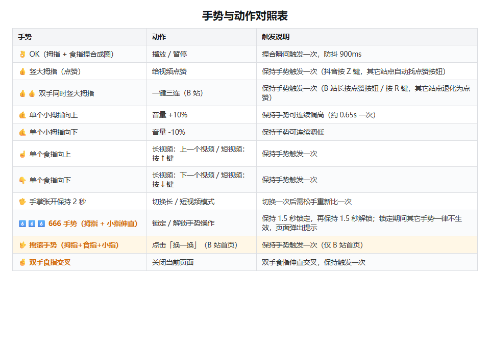
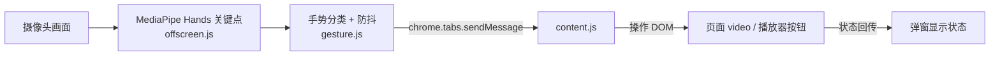
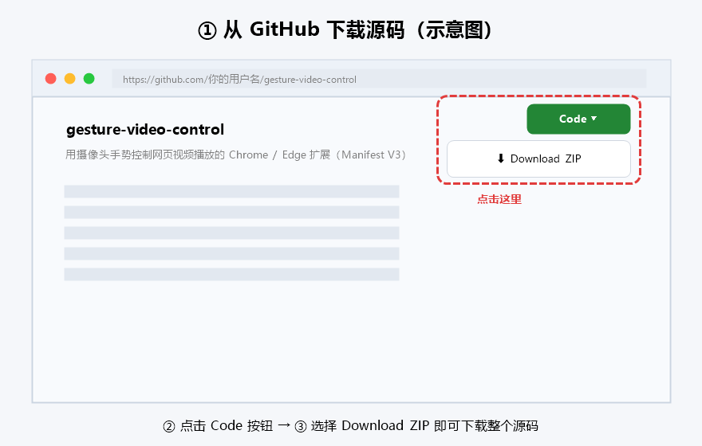
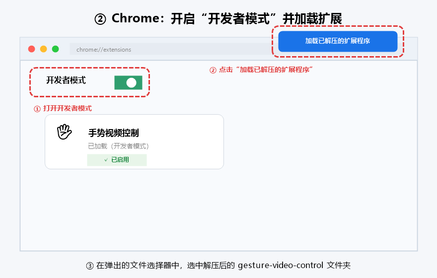
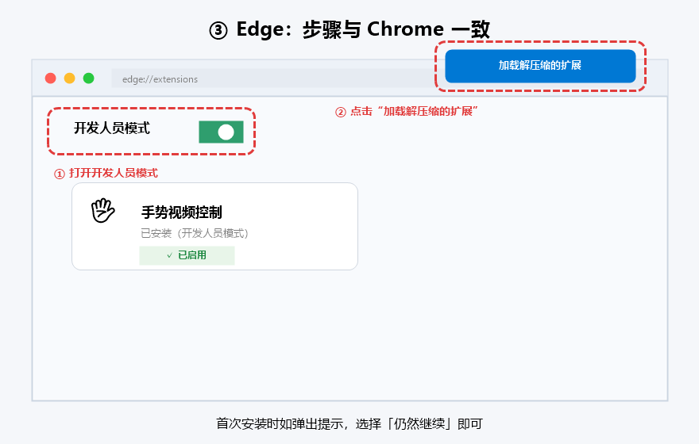

# 手势视频控制 · Gesture Video Control

> 用摄像头手势控制网页视频播放的 **Chrome / Edge 扩展（Manifest V3）**。
> OK 手势播放/暂停、小拇指上下调节音量、食指上下切换视频，支持长/短视频双模式，666 手势可临时锁定，B 站、YouTube 等任意网页播放器。



---

## 目录

- [项目介绍](#项目介绍)
- [功能特性](#功能特性)
- [手势映射表](#手势映射表)
- [工作原理](#工作原理)
- [项目结构](#项目结构)
- [安装教程（图文）](#安装教程图文)
- [使用方法与技巧](#使用方法与技巧)
- [如何打包 .crx（发布者用）](#如何打包-crx发布者用)
- [常见问题 FAQ](#常见问题-faq)
- [隐私说明](#隐私说明)
- [免责声明](#免责声明)
- [开源协议](#开源协议)

---

## 项目介绍

这个扩展通过摄像头实时捕捉你的手部动作，利用 **MediaPipe Hands** 在浏览器本地识别 21 个手部关键点，再把识别出的手势转换成播放控制指令，通过消息机制发送给当前网页，直接操作页面上的 `<video>` 元素或播放器按钮。

**适合场景**：吃饭、健身、做家务时不想碰键盘鼠标，用手势就能控制视频；也适合用来学习和体验「浏览器扩展 + 摄像头 + 端侧 AI」的组合开发。

## 功能特性

- 摄像头实时手势识别（MediaPipe Hands，本地推理，画面**不上传**）
- MediaPipe 模型随扩展**本地打包**（MV3 禁止扩展加载远程代码，CDN 会被浏览器拒绝），无需联网即可使用
- 识别在**后台（offscreen）运行**：关闭弹窗不影响手势控制，也不遮挡视频画面
- 弹窗显示后台识别预览、当前手势、模型状态、页面视频状态
- 支持**页面内悬浮面板**：可拖动、可缩放、可隐藏摄像头画面、可最小化为悬浮球，识别全程不中断
- 「开启 / 关闭手势控制」一键开关，开关状态自动记忆
- **防抖 + 稳定帧检测**：手势需连续稳定数帧才会触发，避免误触
- 音量手势支持**长按连续调节**
- 适配 YouTube / B 站「下一集 / 上一集」按钮，其它网站有通用兜底
- **点赞 / 一键三连**：竖大拇指点赞，双手同时竖大拇指一键三连（B 站长按点赞按钮触发）
- **长 / 短视频双模式**：手掌张开保持 2 秒一键切换；短视频模式下食指上下直接模拟键盘 ↑/↓ 切视频，兼容抖音网页版等推荐流
- **666 手势锁定**：比出 666 手势（拇指 + 小指伸直）保持 1.5 秒，引擎进入锁定状态，期间任何手势都不会操作页面；再比一次 666 手势 1.5 秒即可解锁
- **B 站刷视频**：🤟（拇指+食指+小指）一键点击首页「换一换」刷新推荐流；双手食指交叉直接关闭当前页面
- **B 站首页数字选视频**：在 B 站首页比出数字 1~6 手势，直接打开「换一换」旁边对应位置的视频（1 2 3 / 4 5 6）
- 页面操作成功后会弹出轻量提示浮层（Shadow DOM 隔离，不污染页面样式）
- **判定算法 v2（识别精度重做）**：用「关节夹角」判断手指伸没伸直、归一化坐标做宽高比校正、并结合 MediaPipe 的米制世界坐标；方向（上/下）必须落在竖直圆锥内，手指接近水平时判为「方向不明」宁可不动作；画面里出现两只手时**锁定主手**，手势不会在两只手之间乱跳
- 权限最小化：`activeTab + scripting + storage + alarms`，**不申请全站权限**；只对下面这些视频站申请固定权限（跳转/刷新后控制不掉线），其它网站仍然靠「点图标时临时授权」：
  `bilibili.com`、`youtube.com`、`youtube-nocookie.com`、`douyin.com`、`v.qq.com`、`iqiyi.com`、`youku.com`、`ixigua.com`、`mgtv.com`
- **没在看视频时，观看类手势自动停用**：页面上没有正在播放的视频时，音量 / 切集 / 播放暂停 / 点赞一律不执行，并在界面写明原因（避免在首页比手势乱点）；挑视频（B 站首页数字手势）、🤟 换一换、666 锁定这些页面级手势不受影响
- **弹窗和悬浮面板里都能点开「手势对照表」📖**：不用再翻文档，边看边对照；展开状态会记住
- 自带**离线自测脚本**（`tests/`），改判定阈值前先跑一遍，避免「按下葫芦浮起瓢」
- **断了会自己回来（v1.2 新增自检 + 自动恢复）**：后台每分钟自检一次——识别页被浏览器回收/冻结、识别循环卡死、用手势关掉页面后控制目标失效、页面脚本失效，都会自动重建重启或补注入，页面上提示「🔄 手势识别已自动恢复」，不用你再点一次插件把它叫醒
- **固定站点权限**：给 B 站 / YouTube / 抖音 / 腾讯视频 / 爱奇艺 / 优酷 / 西瓜 / 芒果加了固定权限，这些站点页面跳转、刷新后控制自动接回；其它网站仍走「点图标临时授权」，**不申请全站权限**

## 手势映射表

| 手势 | 动作 | 触发说明 |
| --- | --- | --- |
| 👌 OK（拇指 + 食指捏合成圈） | 播放 / 暂停 | 捏合**瞬间**触发一次，防抖 900ms |
| 👍 竖大拇指（点赞） | 给视频点赞 | 保持手势触发一次（抖音按 Z 键，其它站点自动找点赞按钮） |
| 👍👍 双手同时竖大拇指 | 一键三连（B 站） | 保持手势触发一次（B 站长按点赞按钮 / 按 R 键，其它站点退化为点赞） |
| 🤙 单个小拇指向上 | 音量 +10% | 保持手势可连续调高（约 0.65s 一次） |
| 🤙 单个小拇指向下 | 音量 -10% | 保持手势可连续调低 |
| ☝️ 单个食指向上 | 长视频：上一个视频 / 短视频：按 ↑ 键（上一个视频） | 保持手势触发一次 |
| 👇 单个食指向下 | 长视频：下一个视频 / 短视频：按 ↓ 键（下一个视频） | 保持手势触发一次 |
| 🖐️ 手掌张开保持 2 秒 | 切换长 / 短视频模式 | 切换一次后需松手重新比一次 |
| 6️⃣6️⃣6️⃣ 666 手势（拇指 + 小指伸直） | 锁定 / 解锁手势操作 | 保持 1.5 秒锁定（期间其它手势一律不生效，页面弹出锁定提示），再保持 1.5 秒解锁 |
| 🤟 摇滚手势（拇指+食指+小指） | 点击「换一换」（B 站首页） | 保持手势触发一次（仅 B 站首页） |
| 🤞 双手食指交叉 | 关闭当前页面 | 双手食指伸直交叉保持触发一次 |
| 1️⃣ 数字 1（食指）/ 2️⃣（食指+中指）/ 3️⃣（三指）/ 4️⃣（四指）/ 5️⃣（五指）/ 6️⃣（拇指+小指） | B 站首页选第 N 个视频 | 仅 B 站首页生效（1 2 3 / 4 5 6 对应换一换旁 6 个视频）；其它页面 1/5/6 保持原有功能 |
> 注意：OK 手势不是靠“声音”识别（浏览器无法安全监听麦克风），而是靠“拇指尖与食指尖捏合成圈”的动作来识别。

**两种手势的区别（重要）**：

- **观看类手势**（音量 / 上一集 / 下一集 / 播放暂停 / 点赞）：页面上**正在放视频**才执行；
  没在放视频时会被自动停用，并在界面上写明原因 —— 免得你在首页比划时乱点。
- **页面类手势**（B 站首页数字选视频 1~6、🤟 换一换、666 锁定、双手食指交叉关闭页面）：
  跟有没有视频无关，随时可用。

### 识别精度说明（v2）

判定逻辑在 2026-10 重做过一轮，这几条直接决定「认不认」和「会不会误触发」：

- **手指伸没伸直看「关节夹角」**，不是看长度比值。旧版用「指尖到指根 ÷ PIP 到指根」，
  手掌正对镜头时蜷起的手指在画面上会「折回来」，比值反而暴涨，导致蜷着的手指被判成伸直
  （实测蜷曲中指该比值为 7.6，而门槛只要 1.25）——这是很多「认错手势」的根源。
- **手指方向必须「基本竖直」**：食指 / 小拇指与画面竖直方向夹角超过 55°（快水平了）时判为
  **方向不明，不执行任何动作**。宁可不动，也不会把「向上」猜成「向下」导致音量 / 切集反向。
- **容易混的手势之间留死区**：例如「数字 4（拇指收）」和「手掌张开（拇指伸）」之间，
  拇指状态不明时一律返回「其他手势」，不会随便选一个。
- **点赞要求拇指朝上**：倒过来比（拇指向下）不会触发点赞。
- **画面里有两只手时锁定主手**：优先靠画面中间、离镜头近的那只手，并沿用上一帧的选择，
  不会因为 MediaPipe 返回顺序变化在手与手之间乱跳。
- **时间维度做了平滑**：最近 5 帧多数投票 + 稳定 2 帧确认，单帧抖动不改变结果，
  所以稳住手势约 **0.17 秒**就会触发，比旧版更抗抖也更快。

下表是「什么情况会不动作」的速查：

| 现象 | 原因 | 怎么办 |
| --- | --- | --- |
| 提示「方向不明（倾斜过大）」 | 手指快水平了 | 手指竖直一点再比 |
| 提示「四指伸出但拇指收伸不明（4 还是 5？）」 | 拇指半伸 | 拇指明确收进掌心（4）或完全张开（5） |
| 提示「小指伸直但方向不明」 | 小指水平 | 小指竖直朝上或朝下 |
| 一直显示「其他手势」 | 手指没伸/没蜷到位 | 看提示里四根手指的伸直状态，照着调整 |

**长 / 短视频模式**：

- 默认是**长视频模式**（看横屏剧集）：食指向上 = 上一个视频，食指向下 = 下一个视频；
- **短视频模式**（刷竖屏视频流，如抖音网页版、B 站推荐流、YouTube Shorts）：食指向上 = 按键盘 ↑（上一个视频），食指向下 = 按键盘 ↓（下一个视频），利用网站自带的方向键直切，避免误滚侧边栏；
- 切换方式：手掌张开（五指向上）保持 **2 秒**；再保持 2 秒切回。也可以直接在弹窗 / 悬浮面板里点「短视频模式」开关。

## 工作原理


```mermaid
flowchart LR
  A[摄像头画面] --> B[MediaPipe Hands 关键点<br/>offscreen.js]
  B --> C[手势分类 + 防抖<br/>gesture.js]
  C -->|chrome.tabs.sendMessage| D[content.js]
  D -->|操作 DOM| E[页面 video / 播放器按钮]
  E -->|状态回传| F[弹窗显示状态]
```

1. 点击扩展图标打开弹窗，打开「手势控制」开关后，摄像头与识别引擎在**不可见的离屏文档**（`offscreen.html`）中启动，并加载扩展内**本地打包**的 MediaPipe Hands 模型（无需联网）；
2. 每一帧摄像头画面在后台完成手部关键点识别与手势分类；
3. 识别到有效动作后，后台引擎把动作消息发给目标标签页的 `content.js`；
4. `content.js` 找到页面主 `<video>` 执行播放/暂停/音量调节，或点击“下一集/上一集”按钮 / 模拟方向键切视频；
5. 执行结果回传弹窗展示，同时在页面上显示一条短暂提示；
6. **关闭弹窗后识别继续在后台运行**，你可以专心看视频，随时打开弹窗查看状态或关闭控制。

## 项目结构

```text
gesture-video-control/
├── manifest.json        # MV3 清单：权限、固定站点、弹窗、CSP
├── background.js        # Service Worker：消息路由 + 每分钟自检与自动恢复
├── health.js            # 自检决策（纯逻辑：该不该重建/重启/补脚本，可离线测）
├── content.js           # 内容脚本：操作页面 <video> 与切集按钮
├── gesture.js           # 手势判定核心（关键点 → 手势名称 / 主手选择 / 姿态平滑）
├── gesture-catalog.js   # 手势对照表（数据 + 渲染 + 样式，弹窗与悬浮面板共用）
├── action-policy.js     # 动作闸门：「这个手势现在该不该执行」（没在看视频就拦掉观看类手势）
├── theme.css            # 设计令牌：颜色 / 圆角 / 阴影 / 动效（深浅双主题 + 手动覆盖）
├── theme-mode.js        # 主题模式：跟随系统 / 深色 / 浅色（按钮 + 记忆 + 三处同步）
├── ui-icons.js          # 内联 SVG 图标集（弹窗 / 悬浮窗 / 面板共用，替代 emoji 图标）
├── offscreen.html       # 离屏文档：后台运行摄像头 + 手势识别（不可见）
├── offscreen.js         # 后台识别引擎：摄像头、模型、识别循环、指令发送
├── grant.html / grant.js# 一次性“摄像头授权页”（弹窗权限提示失效时的兜底）
├── float.html           # 旧版独立悬浮窗（已由页面内悬浮面板取代，暂保留）
├── float.css            # 悬浮窗样式
├── float.js             # 悬浮窗控制器（预览、状态、启停后台识别）
├── popup.html           # 弹窗：遥控器（预览、手势、状态、开关）
├── popup.css            # 弹窗样式
├── popup.js             # 弹窗控制器：启停后台识别、状态显示、预览
├── tests/               # 离线自测（合成手模型 / 判定 / 时序 / 自检决策 / 静态体检 / 界面预览生成器）
├── vendor/mediapipe/    # MediaPipe Tasks Vision 本地化资源（vision_bundle.mjs / wasm / hand_landmarker.task）
├── icons/               # 扩展图标（16/32/48/128）
├── docs/                # README 配图
├── assets/              # 设计素材 / 界面预览页（不打进 .crx）
├── pack-crx.ps1         # 一键打包 .crx（Windows）
├── pack-crx.bat         # 打包脚本的批处理入口
├── LICENSE              # MIT 协议
└── .gitignore           # 忽略 .pem 私钥等敏感/产物文件
```

## 安装教程（图文）

### 一、从 GitHub 下载源码

1. 打开本项目的 GitHub 仓库主页：<https://github.com/yidiqingyu/gesture-video-control>
2. 点击页面右侧绿色的 **Code** 按钮，再选择 **Download ZIP**；
3. 把压缩包解压到任意目录（建议路径为纯英文，例如 `D:\extensions\gesture-video-control`）。



### 二、在 Chrome 中加载扩展

1. 在地址栏输入 `chrome://extensions` 并回车；
2. 打开右上角的 **开发者模式** 开关；
3. 点击左上角 **加载已解压的扩展程序**；
4. 选择刚才解压出来的 **gesture-video-control** 文件夹（直接包含 `manifest.json` 的那一层）；
5. 列表中看到「手势视频控制」即安装成功。



### 三、在 Edge 中加载扩展

步骤与 Chrome 完全一致：

1. 地址栏输入 `edge://extensions` 并回车；
2. 打开左侧的 **开发人员模式** 开关；
3. 点击 **加载解压缩的扩展**；
4. 选择解压出的 `gesture-video-control` 文件夹。



> Edge 首次安装开发者模式扩展时会弹出一个提示，选择「仍然继续」即可。

### 四、通过 Release 安装 .crx（可选，适合小白）

如果维护者在 [Releases](https://github.com/yidiqingyu/gesture-video-control/releases) 页提供了打包好的 `.crx` 文件：

1. 下载 `.crx` 文件；
2. 打开 `chrome://extensions` 并开启开发者模式；
3. 把 `.crx` 文件**直接拖进**扩展管理页面，点击「添加扩展程序」；
4. 若浏览器提示「请停用开发者模式下的扩展程序」，忽略即可（仅影响商店内购功能，不影响本扩展）。

> 该 `.crx` 仅供开发者模式安装使用，不是 Chrome 应用商店的正式签名。

## 使用方法与技巧

1. 打开任意视频网站（B 站、YouTube 等）并播放一个视频；
2. 点击浏览器工具栏中的扩展图标，打开控制弹窗；
3. 打开「手势控制」开关，后台识别自动启动；首次使用会弹出摄像头权限提示，选择**允许**；
4. 等待状态行显示「后台手势识别运行中」；
5. **关闭弹窗即可**，识别继续在后台运行，不遮挡视频；
6. 对着摄像头做手势即可控制视频。

**查手势表**：

- 打开弹窗，点最下面的 **📖 手势对照表** 就能展开/收起（展开状态会记住，下次打开还是展开的）；
- 看视频时用的是**页面内悬浮面板**：点面板标题栏的 **📖** 按钮，同一个表格会显示在面板里（面板内容可滚动）。

**使用悬浮面板（推荐看视频时用）**：

- 在弹窗中点击「🪟 打开悬浮面板」，会在**当前页面**出现一块可拖动的悬浮面板（类似画中画），不再打开新窗口；
- 面板显示摄像头画面与当前手势，点标题栏的 **👁** 可显示 / 隐藏画面，点 **—** 可最小化为一个小悬浮球（识别不中断），点 **✕** 关闭面板（识别同样不中断）；
- 拖动面板**标题栏**可任意移动位置，拖动**右下角**可缩放面板大小，位置和大小会自动记忆；
- 拖动**画面底部的分隔条**可自由调整摄像头画面窗口的大小（弹窗和悬浮面板都支持，弹窗 100~320px、面板 90~320px，自动记忆）；
- 在**摄像头画面上滚动鼠标滚轮**可自由缩放画面（0.5x~4x，以鼠标位置为中心），放大后按住画面拖动可查看细节，**双击画面**恢复 100%，缩放状态自动记忆；
- 悬浮球上的圆点变绿表示后台识别正在运行，点悬浮球即可恢复面板。

> **如果打开开关后提示“权限被拒绝”、且没有出现权限提示**（Chrome 弹窗的已知问题）：
> 点击弹窗中的「📷 在标签页中授权摄像头」按钮，在新打开的标签页里授权一次即可——
> 授权后可以关闭该标签页，后台识别会自动接管。

**重要提示**：

- 弹窗关闭后识别**不会停止**（后台运行）；如需关闭控制，重新打开弹窗并关掉「手势控制」开关即可；
- **后台每 1 分钟自检一次**：识别引擎断了、卡住了、或者用手势关掉页面后控制目标失效了，都会**自动恢复**，页面上会提示「🔄 手势识别已自动恢复」，不需要你再点插件把它叫醒；
- 切换标签页时，控制目标会**自动跟到 B 站 / YouTube / 抖音 / 腾讯视频 / 爱奇艺 / 优酷 / 西瓜 / 芒果这些视频站**的标签页；停在这几个站以外的页面手势不动作属正常（不会去乱点别的网页）；
- 浏览器**重启后**不会自动打开摄像头（避免"偷偷开摄像头"的观感），打开一次弹窗即可恢复识别；
- 摄像头使用时，浏览器工具栏会出现相机使用指示，这是正常的；
- 建议距离摄像头 **40~80cm**，光线充足，手掌完整入镜；
- OK = 拇指与食指捏合成圈（不是打响指）；
- 音量 = 小拇指单独伸直指向上/下，保持姿势可连续调节；
- 切集 = 单个食指伸直朝上/朝下一次；短视频模式下食指直接触发键盘 ↑/↓ 切视频。

## 界面与主题（改样式前先看这里）

四处界面（弹窗 / 悬浮窗 / 页面内悬浮面板 / 摄像头授权页）**共用一套设计令牌**：
色值只写在 `theme.css` 里，别的地方一律写 `var(--gvc-xxx)`，不再各写各的。

| 界面 | 怎么拿到令牌 |
| --- | --- |
| 弹窗 `popup.css` / 悬浮窗 `float.css` / 授权页 `grant.html` | `<link rel="stylesheet" href="theme.css">` |
| 页面内悬浮面板（Shadow DOM） | manifest 的 `content_scripts.css` 注入到页面 `:root`，自定义属性会继承进 Shadow DOM |

几条硬规矩：

- **`theme.css` 里只允许有 `:root { --gvc-* }` 和 `[data-gvc-theme]` 这类属性选择器，不许写
  元素/类选择器。** 这份文件会被注入到 B 站 / YouTube 等页面上，一旦写了 `.something { … }`
  就会污染别人的样式。
- **深浅双主题，两层决定**：默认跟随系统（`prefers-color-scheme`，纯 CSS，JS 没跑起来也不闪），
  用户点主题按钮可以强制深色 / 浅色，选择记在 `chrome.storage.local.themeMode`，
  落地的形式就是在元素上写 `data-gvc-theme="dark|light"`（`theme-mode.js` 负责）。
  按钮是**三态循环**：跟随系统 → 与系统相反 → 与系统相同 → 回到跟随系统；
  从默认状态点第一下外观一定会变，连点三下必定转回「跟随系统」。
- **页面内面板不碰网站的 `<html>`**：`data-gvc-theme` 写在**面板/浮层自己的宿主元素**上，
  它自己的声明会盖过从页面继承来的令牌，所以面板能单独跟着用户的选择走。
- **摄像头画面**（`--gvc-stage`）两种主题下都保持深色 —— 视频本身发光，浅底反而刺眼。
- **关闭动画偏好**（`prefers-reduced-motion`）的降级也只在 `theme.css` 一处：动效时长归零、
  循环动画令牌设成 `none`，用它的地方自动跟着关。
- **浅色的值在 `theme.css` 里写了两遍**（媒体查询一份、属性选择器一份）。两处必须逐字一致 ——
  静态体检第 11 组会逐条比对，改一边忘一边直接报红。
- **图标是内联 SVG**（`ui-icons.js`），不再用 emoji 当图标：HTML 里写
  `<span data-icon="camera" data-size="15"></span>`，脚本里调一次 `UIIcons.mount(root)` 替换掉。
  这样各系统粗细一致，颜色也能跟着 `currentColor` 自动适配主题。
  主题按钮统一挂 `data-theme-toggle`（预览页和自测靠它找按钮，图标由 `theme-mode.js` 渲染）。
- **注入顺序不能乱**：`gesture-catalog.js` → `ui-icons.js` → `theme-mode.js` → `content.js`。
  补注入（`chrome.scripting.executeScript`）时还要一并 `insertCSS('theme.css')`，
  否则那个标签页里没有令牌，悬浮面板会变成没有样式的透明框。这些都有自测盯着（静态体检 5b 组）。

**想先看效果再装扩展**：跑

```bash
node tests/build-ui-preview.mjs
```

生成 `assets/20261004_界面改版预览_v1.html`，**双击这一个文件**就能看到全部界面。
样式和结构都是从真实文件里抠出来内联的（每个界面各自待在 Shadow DOM 里，避免 `popup.css`
和 `float.css` 的同名类互相打架），所以**改了样式重新跑一次就同步，不会出现"预览跟实际不一样"**。

## 开发：改阈值前先跑自测

手势判定全是阈值逻辑，凭感觉调参必然「按下葫芦浮起瓢」（本项目历史上那一串 `fix: 放宽/收紧 XX 判定` 就是这么来的）。
`tests/` 里有一套离线自测，用**正运动学合成一只手**，没有摄像头也能验证判定：

```bash
node tests/run-all.mjs            # 一条命令跑完下面全部自测（推荐，共 669 项）
node tests/integration-check.mjs  # 静态体检：manifest / HTML 引用 / 接口一致性 / 权限与站点清单 /
                                  #   DOM id / 编码 / 手势表数据 / 动作闸门分类 / 打包清单 /
                                  #   主题令牌（用到的变量都有定义、浅色两处一致、没有死令牌）/
                                  #   主题模式（点一下外观一定变、三步内回到跟随系统），共 293 项
node tests/gesture-selftest.mjs   # 判定正确性：姿势 / 手歪手转 / 宽高比 / 左右手 / 抖动，共 229 项
node tests/engine-sim.mjs         # 时序：抗抖动 / 跟手速度 / 稳定速度 / 主手不跳 / 漏检容错，共 13 项
node tests/health-selftest.mjs    # 自检决策：识别页没了 / 卡死 / 目标页被关 / 脚本失效，共 44 项
node tests/policy-selftest.mjs    # 动作闸门：哪些手势需要"正在看视频"，共 90 项
node tests/gesture-inspect.mjs    # 打印每个手势的中间量（各手指伸展度、捏合比例、方向），调阈值时看这个
node tests/gesture-inspect.mjs ok four -v   # 只看指定手势，加 -v 附带拇指明细
node tests/build-ui-preview.mjs   # 生成界面预览页（不是测试，是给人看图用的）
node tests/verify-crx.mjs         # 打包后核对 .crx：版本号 / 文件清单 / 有没有夹带私钥与测试
```

改动 `gesture.js` 的阈值、`health.js` 的自检策略、或 `action-policy.js` 的动作分类后，**自测要全绿**再提交。

> **手势有变动时改哪里**：插件里显示的手势表，唯一数据源是 `gesture-catalog.js`
> （弹窗和悬浮面板都从它取，改一处两边都对）。本 README 上面的对照表是给人看的镜像，
> 改了记得一起同步，否则插件和文档会说的不一样。
>
> **改源码请用编辑器改**：不要用 PowerShell 做文本替换——PowerShell 5.1 读 UTF-8 源码时
> 会按系统代码页（GBK）解码再按 UTF-8 写回，**整个文件的中文会变成乱码**，
> 而且语法检查照样通过（乱码也是合法字符串）。`tests/integration-check.mjs` 里的
> 「编码体检」会拦住这种事故。
>
> **改完 `pack-crx.ps1` 要确认 BOM 还在**：这个脚本里有中文，必须是「UTF-8 带 BOM」，
> 否则 Windows PowerShell 5.1 会按 GBK 读它，打包直接报语法错误。编辑器保存时容易
> 悄悄把 BOM 吃掉，所以静态体检第 10 组专门盯着这件事（少一个字节就报红）。
> 补回来的办法（只加字节、不转码）：
>
> ```powershell
> $p = 'pack-crx.ps1'
> [System.IO.File]::WriteAllBytes($p, [byte[]](0xEF,0xBB,0xBF) + [System.IO.File]::ReadAllBytes($p))
> ```

## 如何打包 .crx（发布者用）
### 方式一：一键脚本（Windows）

在项目目录双击 `pack-crx.bat`，或执行：

```powershell
powershell -ExecutionPolicy Bypass -File .\pack-crx.ps1
```

脚本会自动寻找本机 Chrome / Edge 并打包，产物收在项目下的 **`dist\`** 目录里（`.gitignore` 已忽略，不会进仓库）：

- `dist\gesture-video-control.crx` —— 可上传到 GitHub Release 供用户拖拽安装；
- `dist\gesture-video-control.pem` —— **扩展私钥，请务必保密，不要提交到仓库**；也**别弄丢**。

> 📦 脚本**不会直接打包项目目录**：它会先复制出一份「只含运行必需文件」的快照
> （排除 `.git` 完整提交历史、`tests\`、`memory\` 工作记录、`drafts\`、`trash\`、`.agents\`、
> 私钥与产物本身），打包完再把快照删掉。这样用户拿到的 `.crx` 里只有插件本身（约 15 MB），
> 不会把你的提交历史和本机工作记录一起带出去。

以后想保持同一个扩展 ID 更新，保留 `.pem` 并再次打包：

```powershell
powershell -ExecutionPolicy Bypass -File .\pack-crx.ps1 -Key .\dist\gesture-video-control.pem
```

**打包完一定要核对一下**（`.crx` 里的 manifest 是压缩在 ZIP 里的，肉眼看不出是哪一版，
历史上就出现过"以为打的是新版、其实拿到的是旧包"）：

```bash
node tests/verify-crx.mjs --expect 1.4.0
```

它会拆开 `.crx`，报出版本号、文件清单、以及有没有误把私钥 / 测试 / 工作记录打进去，
顺手还会用 `.pem` 算出扩展 ID —— **ID 变了就说明私钥换了**，老用户装新包会变成两个扩展。

> ⚠️ **`.pem` 千万别丢**：扩展 ID 由这个密钥决定。丢了它再打包会生成新的扩展 ID，
> 老用户装上新 `.crx` 会变成“两个扩展”。建议把它备份到只有你能看到的地方（不要放仓库、不要放网盘公开目录）。
>
> 💡 打包时如果 Chrome 正在运行，它会把这个命令转交给已有窗口、不执行打包 —— 请先完全退出 Chrome
> （脚本检测不到产物时也会提示这一点）。

### 方式二：Chrome 界面打包

1. 打开 `chrome://extensions`，开启开发者模式；
2. 点击 **打包扩展程序**；
3. 「扩展程序根目录」选择本项目文件夹，点击 **打包扩展程序**；
4. 得到 `.crx` 与 `.pem` 两个文件，把 `.crx` 上传到 GitHub Release 即可。

### 方式三：命令行手动打包

```bash
# Chrome
"C:\Program Files\Google\Chrome\Application\chrome.exe" --pack-extension="D:\extensions\gesture-video-control"

# Edge
"C:\Program Files (x86)\Microsoft\Edge\Application\msedge.exe" --pack-extension="D:\extensions\gesture-video-control"
```

## 常见问题 FAQ

### 1. 摄像头权限被拒绝 / 弹窗不显示画面

- 打开弹窗并打开「手势控制」开关，浏览器会弹出摄像头权限提示，请点击「允许」；
- 如果没看到提示、且状态直接显示“权限被拒绝”，请点击弹窗中的「📷 在标签页中授权摄像头」，在新标签页里授权一次（Chrome 存在弹窗权限提示被自动丢弃的已知问题，标签页方式最稳定）；
- 如果之前误点过“阻止”，需要重置权限：打开 `chrome://settings/content/camera`，找到本扩展（`chrome-extension` 开头）的记录并删除 / 重置，然后重新打开弹窗；
- 也可以点击地址栏左侧的摄像头权限图标，把「相机」权限改为允许；
- 若提示“未检测到摄像头”或“摄像头被占用”，请检查摄像头是否连接、驱动是否正常、是否有视频会议软件正在使用摄像头；Windows 用户还可检查「设置 → 隐私和安全性 → 相机」中是否允许桌面应用访问相机。

### 2. 手势没有反应

- 确认状态行显示「✅ 手势识别运行中」；模型已随扩展本地打包，正常情况不需要联网；
- 若仍提示模型加载失败，请检查 `vendor/mediapipe/` 目录下的文件是否完整；
- 确认「手势控制」开关已打开（识别会一直运行，但只有开关打开才会执行动作）；
- 检查光线、距离与手势是否标准：手势需要**稳定约 0.17 秒**（最近 5 帧多数投票 + 稳定 2 帧确认）才会触发，抖太快会判定为误触；
- **手指方向要竖直**：食指 / 小拇指接近水平时会被判成「方向不明」而不动作（这是防「音量 / 切集方向乱跳」的设计），把手指竖起来再比即可；
- OK 手势需要拇指与食指「捏合成圈」，捏住不放不会重复触发（防抖设计）；
- 如果弹窗显示「其他手势」，下方会列出四根手指的伸直状态（例如“食指伸直·中指半弯…”），照着提示调整手势即可；显示「未检测到手」时，请确认手掌完整入镜、光线充足，并在镜头前停留约 0.17 秒。

### 3. 提示「当前页面未检测到视频」

- 页面确实没有可见的 `<video>`（例如纯音频播放、后台播放）；
- 视频播放器尺寸过小或隐藏（例如在滚动视口之外、折叠面板里）；
- 请把视频播放器滚动到可见区域后再试。

### 4. 弹窗关闭后手势还能用吗？

能。本扩展的手势识别运行在不可见的后台离屏文档中，**关闭弹窗不会停止识别**，也不会遮挡视频。需要停止时，重新打开弹窗并关闭「手势控制」开关即可。

后台每 **1 分钟**自检一次（见下一条），断了会自动恢复，所以不需要靠"开着弹窗"来维持它。

### 4.1 用一段时间就不响应了，必须点一下插件才行？

**v1.1 之前确实有这个毛病，v1.2 已经修好了。** 原因有三个，都是"断了没人管"：

1. MV3 的后台 Service Worker 空闲约 30 秒会被浏览器回收，离屏识别页也可能被关掉或被浏览器冻结降频——旧版**没有任何代码会去重建它**（以前只有你打开弹窗才会顺带重建，所以"开着弹窗就正常、关掉弹窗过一会就失灵"）；
2. **用手势关闭当前页面后**，控制目标还指着那个已经被关掉的标签页，之后所有指令都发给一个不存在的页面；
3. 摄像头被其它程序抢占、或画面卡住时，旧版不会重开摄像头。

现在这三条都由后台自检兜住了：每分钟检查「识别页还在不在、帧数还在不在涨、控制目标还在不在、页面脚本还在不在」，发现异常自动重建重启，并在页面上提示「🔄 手势识别已自动恢复」。

只有一种情况还需要你点一下扩展图标：**在非视频站页面（例如博客里嵌入的播放器）刷新过页面**——Chrome 规定点击图标给的临时授权在页面刷新后就作废了，这时弹窗里会明确提示「页面脚本已失效，点一下扩展图标即可恢复控制」。

### 4.2 在 B 站首页比「1」选视频，怎么变成「上一集」了？

**v1.3.0 已修。** 原因：后台识别引擎里有个「当前页是不是 B 站首页」的标志，决定"数字手势选视频"走不走；
但它以前**只在页面类型发生变化时**才被同步一次，而打开弹窗启动识别时又没带上这个标志 ——
引擎重启后这个标志一直是 `false`，于是首页比「1」就掉进了「食指向上 = 上一集」的分支。

现在改成：**每次刷新页面视频状态时都把这个标志一起同步回来**（引擎启动时、切标签页时、每 3 秒一次），
不再依赖"变化时才通知"。

顺带做了：**没在看视频时，观看类手势（音量 / 切集 / 播放暂停 / 点赞）一律不执行**，
并显示「当前页面没有正在播放的视频，这个手势不执行」——
既避免首页误触发，也避免"点了没反应、又不知道为啥"。

### 5. 播放 / 暂停在某些网站无效

扩展发起的 `play()` 不算“用户手势”，浏览器自动播放策略可能拒绝。遇到这种情况，**先在页面上手动点击一次视频**，解除限制后再用手势控制即可。

### 6. 切集（下一集/上一集）无效

不同网站的按钮结构不同。本项目已适配 YouTube 与 B 站的新旧播放器，其它网站会尝试按 `aria-label` / class 匹配；如果找不到按钮，弹窗会提示「未找到下一集按钮」。你可以在 `content.js` 的 `NEXT_SELECTORS` / `PREV_SELECTORS` 里补充对应网站的选择器。

### 7. 全屏播放时不能用

浏览器全屏时弹窗会被遮挡。请退出全屏后再用手势控制，或使用“网页内嵌全屏”（如 B 站网页全屏）。

### 8. 内嵌 iframe 播放器（如别人博客里嵌入的 YouTube）不能用

当前版本只向标签页顶层页面注入脚本，跨域 iframe 内嵌播放器暂不支持。

### 9. 想上架 Chrome 应用商店怎么办？

本项目已经把 MediaPipe 的 JS / wasm / 模型文件全部本地化到 `vendor/mediapipe/`，**满足 Manifest V3 不允许远程代码的要求**，可直接走商店审核。上架时请确保该目录完整，并留意商店对隐私政策与权限说明的要求。

### 10. 这个扩展会偷拍 / 上传我的摄像头画面吗？

不会。摄像头画面只在你的浏览器后台离屏文档里被 MediaPipe 处理，扩展不包含任何网络上传代码，也不需要 `host_permissions` 全站权限。

### 11. 为什么不用 CDN 加载 MediaPipe？

Manifest V3 明确禁止扩展页面加载远程代码：Chrome / Edge 会直接拒绝在 `content_security_policy.extension_pages` 中出现的远程 `script-src` 域名（打包时报 `Insecure CSP value`），扩展将无法打包或加载。因此本项目把官方 npm 包（`@mediapipe/tasks-vision@0.10.35`）的运行时文件与官方手部模型 `hand_landmarker.task` **本地化**到 `vendor/mediapipe/`，API 用法与 CDN 完全一致，同时获得“离线可用、无第三方依赖”的好处。

### 12. Chrome 提示“扩展程序已停用”或“非应用商店来源”怎么办？

这是 Chrome 的安全策略，**不是扩展故障**：未上架 Chrome 应用商店的扩展（包括开发者模式加载的）随时可能被 Chrome 自动停用，尤其是关闭了“开发者模式”或重启浏览器之后。

处理方法：

1. 打开 `chrome://extensions`；
2. 确认右上角「开发者模式」开关处于**打开**状态；
3. 找到「手势视频控制」：如果显示“已停用”，点击右侧开关重新启用；如果卡片显示“此扩展程序可能已损坏”，点击「移除」后重新用“加载已解压的扩展程序”加载（务必选择**解压后的文件夹**而不是 ZIP，并建议放在纯英文路径）；
4. 如果弹出“停用开发者模式扩展程序”的提示，选择「取消」（不要选“移除”）；
5. 每次重启浏览器后可能再次被停用，重新打开开关即可。

长期方案：

- 日常使用更推荐 **Edge**（`edge://extensions` → 开发人员模式 → 加载解压缩的扩展），Edge 对开发者模式扩展的停用策略比 Chrome 温和；
- 一劳永逸的办法是把扩展上架到 Chrome 应用商店（本项目已是 MV3 且无远程代码，符合上架要求）；
- 企业 / 自管理电脑可通过组策略把扩展 ID 加入白名单。

### 13. 为什么建议把扩展放到普通本地文件夹，而不是 OneDrive / 网盘同步目录？

Chrome 加载“已解压的扩展程序”时需要稳定读取文件夹里的所有文件。放在 OneDrive 桌面或网盘同步目录时，文件可能处于“云端占位”状态、被同步锁定或属性变化，轻则扩展显示异常、按钮无响应，重则提示“此扩展程序可能已损坏”。建议：

- 把 `gesture-video-control` 文件夹复制到纯本地路径（例如 `D:\extensions\gesture-video-control` 或 `C:\Users\你的用户名\Documents\extensions\gesture-video-control`）；
- 在 `chrome://extensions` 中把旧的扩展**移除**，再从新路径重新“加载已解压的扩展程序”；
- 每次从 GitHub 下载新版本后，覆盖到同一个文件夹，再在扩展卡片上点击刷新（重新加载）即可。

### 14. 为什么插件弹窗的四个角是直角？

因为**弹窗窗口的形状不是扩展能决定的**。Chrome 把弹窗内容当成窗口里的一个 iframe，外面那层窗口由浏览器自己绘制（Chrome 开发者的回复，见 [SO #56395186](https://stackoverflow.com/questions/56395186)），扩展没法给它加圆角。

我们试过让插件主体自己带圆角、圆角外面露出一圈衬底色，确实能在视觉上做出圆角（做法是加一个 `--gvc-frame` 衬底令牌 + `--gvc-radius-outer` 外框圆角）；但窗口最外面那圈仍然是方的，权衡之后**这一版没有采用**，保持了干净的整块深色。想再要的话，工作记录 `memory/20261004_界面改版与双主题_v1.md` 第 9 节记了完整改法与坑。

> 页面内悬浮面板**不受这个限制** —— 它画在网页里、由扩展自己的元素决定外形，本来就是圆角的。

## 隐私说明

- 摄像头画面**仅在本机浏览器内**处理，不经过任何服务器；
- 扩展申请的权限：`activeTab`（操作你点击时的当前标签页）、`scripting`（注入内容脚本）、`storage`（记住开关状态）、`offscreen`（后台跑识别，不占你的窗口）、`alarms`（每分钟自检一次，识别断了自动恢复）、`debugger`（B 站「换一换」「数字选视频」需要真实鼠标事件，仅在点这两个动作时短暂附加、用完立即分离）；
- **不申请全站权限**：只对 B 站 / YouTube / 抖音 / 腾讯视频 / 爱奇艺 / 优酷 / 西瓜 / 芒果这几个视频站有固定权限（用于跳转、刷新后自动接回控制）。其它任意网站只在**你点击扩展图标时**临时获得当前标签页的访问权；
- 自检记录（是否正常运行、帧数）只存在浏览器本地 `storage` 里，不上传；
- 不收集、不存储、不上传任何个人信息。

## 免责声明

本扩展仅供学习与个人使用。请遵守所在视频网站的服务条款与当地法律法规；因使用本扩展产生的一切后果由使用者自行承担。

## 开源协议

本项目基于 [MIT License](LICENSE) 开源，欢迎 Fork、修改与提交 PR。
